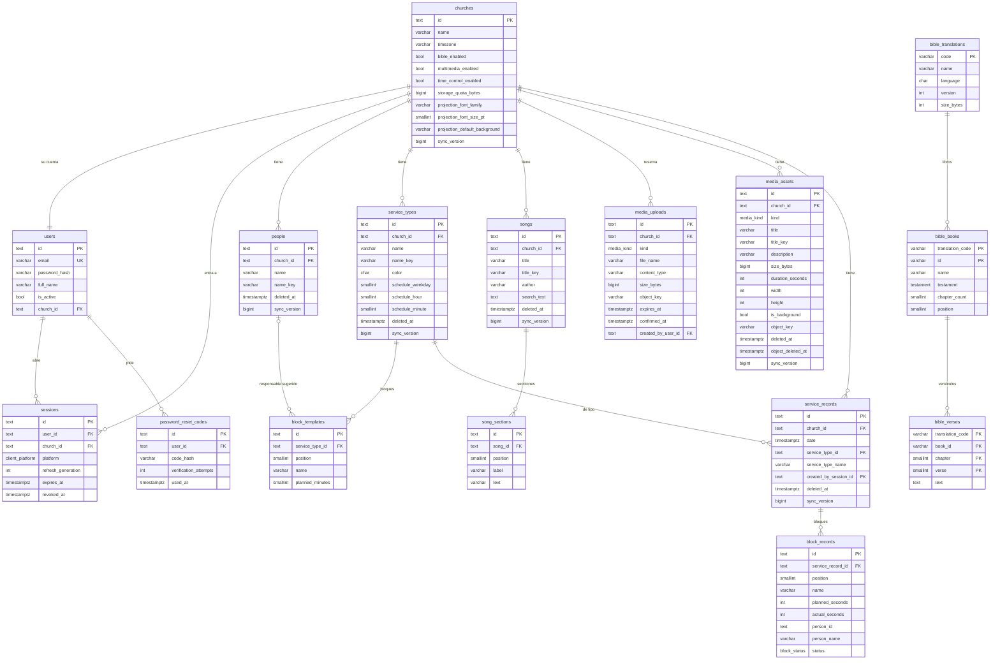

# Modelo de datos · Iris

Base `iris`, esquema `iris`, rol `iris_app` en el contenedor compartido `atmosfera-postgres`.
La fuente de verdad es `prisma/schema.prisma`; este documento explica lo que el schema no dice solo.

Convenciones: tablas en `snake_case` plural, columnas en `snake_case`, ids UUID v7 en texto,
fechas `timestamptz(3)` en UTC.

## Diagrama

## Cuentas

| Tabla | Lo no obvio |
|---|---|
| `churches` | El tenant. Todo el contenido cuelga de aquí. `timezone` (IANA, por defecto `America/Lima`) define "hoy" y los horarios. Lleva `sync_version` porque el feed de las consolas informa cambios de nombre, zona y módulos |
| `users` | La cuenta de una iglesia: `church_id` (`ON DELETE CASCADE`) la ata a una sola iglesia y no hay roles ni equipo. `email` siempre en minúsculas y recortado |
| `sessions` | Una por dispositivo. El refresh token **no** se guarda: es `<id>.<generación>.<HMAC>` y la tabla solo guarda `refresh_generation`. `expires_at` se corre 60 días en cada refresh. `church_id` es siempre la iglesia de la cuenta. `revoked_reason` es `SIGN_OUT`, `SIGN_OUT_ALL`, `PASSWORD_RESET` o `TOKEN_REUSE` |
| `password_reset_codes` | El código se guarda hasheado (argon2). Máximo 5 intentos y 3 envíos por día por usuario |

## Contenido de la iglesia (fase 03)

| Tabla | Lo no obvio |
|---|---|
| `churches` (módulos) | `bible_enabled`, `multimedia_enabled`, `time_control_enabled` (Letras siempre está activo, sin columna) y `storage_quota_bytes` (5 GiB por defecto) |
| `people` | Quien dirige un bloque en cada servicio (se registra en `block_records`); no es un usuario. `name_key` = `nameKey(name)` (contrato §2), único **parcial** por iglesia entre las no borradas. Borrar una persona no toca las plantillas |
| `service_types` | Horario en hora local de la iglesia (`weekday` 1 = domingo). `CHECK`: los tres campos del horario son todos `null` o todos válidos. `color` es uno de los seis de la paleta. `name_key` único parcial |
| `block_templates` | Sin `sync_version` propia: cada escritura reemplaza la lista y actualiza el padre. Único `(service_type_id, position)` **diferible** (`DEFERRABLE INITIALLY DEFERRED`) para poder reordenar dentro de una transacción. `CHECK planned_minutes BETWEEN 1 AND 240`. |

## Canciones (fase 04)

| Tabla | Lo no obvio |
|---|---|
| `songs` | `title_key` = `nameKey(title)`: **no** es único (dos versiones de una canción son válidas); sirve para ordenar y buscar por título. `search_text` = `searchText(title, author, …secciones)`, recalculado por el servicio en cada escritura. Índice GIN `gin_trgm_ops` sobre `search_text` (extensión `pg_trgm` en el esquema `iris`) |
| `song_sections` | Una sección = una pantalla del TV. Se reemplazan completas en cada escritura (ids nuevos). Único `(song_id, position)` |

Búsqueda: `search_text ILIKE '%q%' OR word_similarity(q, search_text) > 0.6`, con `q` normalizada por `nameKey`;
primero las que coinciden en el título, luego por parecido.

## Multimedia (fase 05)

Los bytes viven en el almacenamiento S3 compatible (MinIO en local, R2 en producción); ni la base ni el API los tocan.
Clave del objeto: `churches/<churchId>/media/<id>/<nombre-saneado>`, nunca expuesta al cliente.

| Tabla | Lo no obvio |
|---|---|
| `media_uploads` | Ticket de subida: reserva cuota durante 1 h. Cuota = medios no borrados + subidas pendientes sin vencer + el archivo nuevo ≤ `storage_quota_bytes`, comprobada bajo el candado de la iglesia. La limpieza horaria borra los vencidos sin confirmar (y su objeto) |
| `media_assets` | Se crea al confirmar, **con el mismo id** que la subida. `is_background` solo puede ser `true` en imágenes. `duration_seconds` (audio y video) y `width`/`height` (imagen y video) los mide el cliente y se guardan enteros. El borrado suave libera la cuota al instante; 24 h después la limpieza borra el objeto y marca `object_deleted_at` |

## Tiempos (fase 07)

Solo tiempos: lo proyectado nunca se guarda.

| Tabla | Lo no obvio |
|---|---|
| `service_records` | El `id` lo genera la consola (el `PUT` es idempotente). `date` = inicio del primer bloque, UTC. `service_type_id` con FK `ON DELETE NO ACTION` (los tipos solo se borran en suave; `NO ACTION` y no `RESTRICT` para que borrar una iglesia en cascada no falle por el orden). `service_type_name` copia el nombre por si el tipo se borra. `created_by_session_id` (`SET NULL`) indica qué dispositivo lo guardó |
| `block_records` | `id` también de la consola. `person_id` **sin** FK a propósito: el registro conserva el id de una persona borrada, y `person_name` su nombre en ese momento. `status` `ADJUSTED` lo pone solo la API al corregir la duración. `CHECK` de segundos ≥ 0. `blockCount` de `/people` cuenta los no `SKIPPED` de registros no borrados |

## Biblia (fase 06)

Contenido **global**, sin `church_id`. Lo carga `pnpm db:import-bible` (fuente y licencia en `docs/bible-source.md`).

| Tabla | Lo no obvio |
|---|---|
| `bible_translations` | `version` sube con cada `--force`; las consolas vuelven a descargar cuando cambia (ETag `"<code>-<version>"`). `size_bytes` = tamaño de la descarga **comprimida** |
| `bible_books` | PK `(translation_code, id)`, `id` en USFM (`GEN`, `JHN`). `position` 1–66 en orden canónico |
| `bible_verses` | PK `(translation_code, book_id, chapter, verse)`. El texto puede estar vacío (versículos unidos al anterior) |

## Sincronización (fase 00)

Las consolas mantienen una copia local con `GET /sync/changes`. Para eso:

- **Secuencia global** `iris.sync_version_seq` y función `iris.bump_sync_version()`.
- Cada tabla sincronizable tiene `sync_version bigint` y un trigger
  `BEFORE INSERT OR UPDATE … EXECUTE FUNCTION iris.bump_sync_version()` que le asigna
  `nextval` en cada escritura. El código nunca escribe esa columna.
- Índice `(church_id, sync_version)` en cada tabla sincronizable (`churches`: solo `sync_version`).
- **Orden de confirmación**: toda escritura sobre tablas sincronizables corre en una transacción que primero
  toma `pg_advisory_xact_lock(hashtextextended('iris_sync:' || church_id, 0))`
  (`src/database/church-write-lock.ts`). Así, dentro de una iglesia, una versión menor siempre se confirma antes
  que una mayor y el cursor nunca se salta filas.
- Los hijos (secciones, bloques) no llevan versión: al cambiar, el repositorio toca el `updated_at` del padre y
  el trigger del padre sube su versión.

## Borrado suave

Las tablas de contenido llevan `deleted_at`. Las lecturas normales filtran `deleted_at IS NULL`; la
sincronización informa los borrados. Los únicos por *nameKey* son **parciales** (`WHERE deleted_at IS NULL`),
declarados en el schema con la preview `partialIndexes` de Prisma, para poder reutilizar el nombre de algo borrado.

## Interruptores del sistema — `system_features`

| Columna | Tipo | |
|---|---|---|
| `key` | varchar(40) PK | nombre del módulo: `bible`, `multimedia`, `timeControl` |
| `enabled` | boolean | `false` lo apaga para todas las iglesias |
| `description` | varchar(200) | para quien lo cambia a mano |
| `updated_at` | timestamptz | |

Sin pantalla: se cambia en la base (`UPDATE iris.system_features SET enabled = true WHERE key = 'bible';`).
El trigger `system_features_touch_churches` toca todas las iglesias para que suban de `sync_version` y las
consolas lean sus módulos otra vez. Un módulo sin fila está disponible. La migración
`20261007020000_system_features` crea la fila de la Biblia en `false`.
